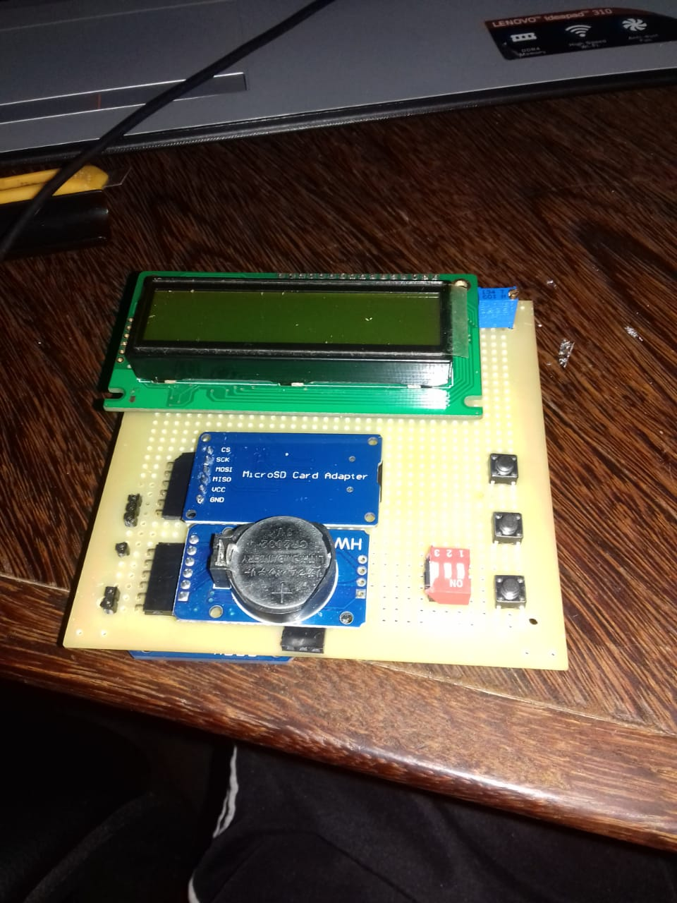
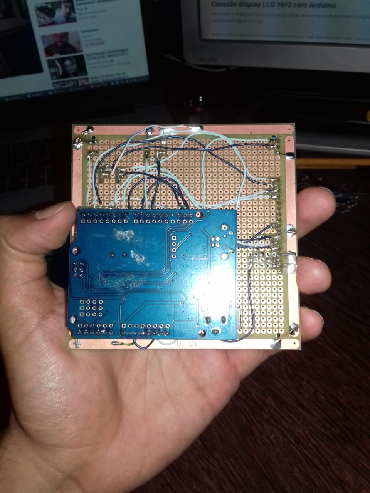

# Sistema de Medição de Vazão com Arduino

Este projeto implementa um sistema de medição de vazão de água utilizando Arduino, sensor de fluxo, display LCD e cartão SD. Os dados de volume de água e tempo de uso são salvos com data e hora em um arquivo `.txt`, e podem ser visualizados diretamente no display com navegação entre leituras anteriores.

## Funcionalidades

- Medição em tempo real do fluxo de água
- Registro dos dados em cartão microSD com data e hora (RTC)
- Exibição dos dados em display LCD 16x2
- Três botões para:
  - Alternar entre modo de gravação e leitura
  - Navegar entre registros anteriores e posteriores
  - Alternar exibição entre volume e tempo

## Componentes Utilizados

- Arduino (Uno, Nano, Mega ou equivalente)
- Sensor de fluxo de água (ex: YF-S201)
- Cartão microSD com módulo leitor (SPI)
- Display LCD 16x2 (interface paralela)
- Módulo RTC DS3231
- 3 botões (leitura, voltar, avançar)
- Jumpers e resistores (pull-up internos ativados)

## Ligações (Pinagem)

| Componente       | Pinos Arduino         |
|------------------|------------------------|
| Sensor de fluxo  | D3 (interrupção 1)     |
| LCD 16x2         | D8, D7, D6, D5, D2, D1 |
| Cartão SD (SPI)  | MOSI (11), MISO (12), CLK (13), CS (4) |
| Botão de modo    | A0                     |
| Botão voltar     | D9                     |
| Botão avançar    | D10                    |
| RTC DS3231 (I2C) | SDA (A4), SCL (A5)     |

## Estrutura do Arquivo de Dados

Cada linha do arquivo `medicoes.txt` é salva no seguinte formato:
DD/MM/YYYY VVVVVVL HH:MM:SS

- `DD/MM/YYYY` – Data da medição
- `VVVVVVL` – Volume de água acumulado (com 6 casas decimais) + "L"
- `HH:MM:SS` – Tempo total de uso do sensor desde a última gravação

## Como Usar

1. Instale as bibliotecas `RTClib` e `LiquidCrystal` na IDE Arduino.
2. Faça o upload do código no Arduino.
3. Insira um cartão SD formatado e vazio no módulo leitor.
4. Alimente o sistema e verifique o display.
5. Use os botões para alternar entre modo de gravação/leitura e navegar pelas leituras.

## Ajustes Úteis

- Para ajustar a hora no RTC, descomente a linha com `rtc.adjust(DateTime(F(__DATE__), F(__TIME__)));` e carregue o código novamente.
- O sistema assume que o arquivo `medicoes.txt` já existe. Crie-o manualmente no cartão SD se necessário.

## Imagens

## Licença

Este projeto está sob a licença MIT. Sinta-se livre para modificar, utilizar e compartilhar.

